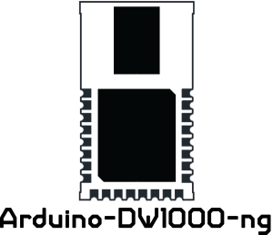

 

  

 

### Arduino driver for Decawave's [DWM1000](http://www.decawave.com/products/dwm1000-module) module.

 

Installation
------------
**Requires c++11 support**, Arduino IDE >= 1.6.6 support c++11.

 1. Get a ZIP file of the master branch or the latest release and save somewhere on your machine.
 2. Open your Arduino IDE and goto _Sketch_ / _Include Library_ / _Add .ZIP Library..._
 3. Select the downloaded ZIP file of the DW1000 library
 4. You should now see the library in the list and have access to the examples in the dedicated section of the IDE

Usage
-----
Check examples for basic usage.

License
-------
Apache License 2.0 (see [LICENSE.md](https://github.com/F-Army/arduino-dwm1000/blob/master/LICENSE.md))
