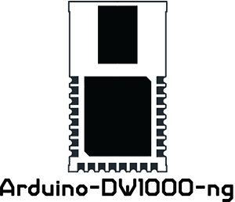

 

  

 

### Arduino library to use Decawave's [DW1000](https://www.decawave.com/product/dw1000-radio-ic/) IC and relative modules.

Status
------------
This is actively developed.

Differences with thotro/arduino-dw1000
------------
This is a fork of https://github.com/thotro/arduino-dw1000. 
The main reason for this fork is because the development there is really slow (due to the original author not developing it anymore) and some important features were missing (for example antenna delay calibration).  
We also wanted to change how the ranging logic works. 
Rather than providing a ranging loop, we wanted to provide functions to send the different Two way ranging flow frames, giving the user more control over the program.  
The base driver was also re-written in a lot of places, to make every API function more independent from each other.

Features
------------

 

Installation
------------
**Requires c++11 support**, Arduino IDE >= 1.6.6 support c++11.

 1. Get a ZIP file of the master branch or the latest release and save somewhere on your machine.
 2. Open your Arduino IDE and goto _Sketch_ / _Include Library_ / _Add .ZIP Library..._
 3. Select the downloaded ZIP file of the DW1000 library
 4. You should now see the library in the list and have access to the examples in the dedicated section of the IDE

Usage
-----
Check examples folder for basic usage.

Authors
------------
<ul>
  <li><b> Michele 'an4cr0n' Biondi </b>: https://github.com/an4cr0n</li>
  <li><b>Andrea 'Sonic0' Salvatori</b>: https://github.com/Sonic0</li>
</ul>

License
-------
The project is under MIT (see [LICENSE.md](https://github.com/F-Army/arduino-dw1000Ng/blob/master/LICENSE.md))  
Some files are under a Dual Apache 2.0/MIT because this is a fork of [thotro/arduino-dw1000](https://github.com/thotro/arduino-dw1000)
